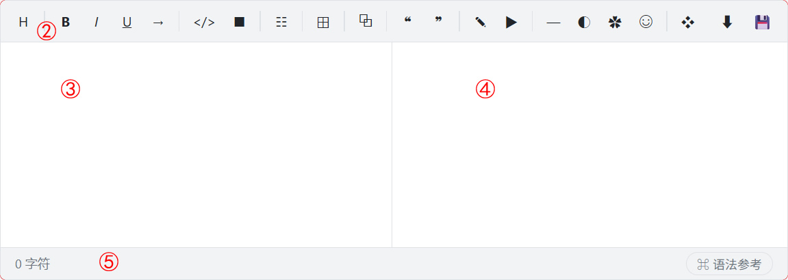
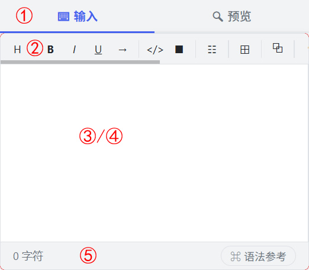

<p align="center">
  
</p>

<p align="center">
  
  
  
  
  
</p>

# 朱码 JS 编辑器

为[朱码](https://gitee.com/drewneon/drewmark)量身定制的**所见即所得**编辑器，基于**原生 JavaScript**（Vanilla JS）开发，零依赖。内置[朱码 JS 解析器](https://gitee.com/drewneon/drewmark-js-parser)，实现实时编辑、预览和下载朱码格式的内容。

---

## 快速开始

### 方式一：工程化项目（Node.js + 构建工具）

适用于使用 Webpack、Vite、Rollup 等构建工具的项目。

**1. 安装依赖**

```bash
npm install drewmark-editor
```

**2. 在源码中导入并使用**

在入口文件或组件中导入编辑器及样式文件，并调用初始化函数：

```javascript
// 导入样式（根据实际构建工具要求调整路径）
import 'drewmark-editor/css/drewmark-editor.min.css';

// 导入编辑器
import drewmarkEditor from 'drewmark-editor';

// 初始化编辑器（默认挂载到 #drewmark-editor 容器）
drewmarkEditor();
```

注：请确保 HTML 中存在 `id` 为 `drewmark-editor` 的容器元素，或在初始化时通过参数指定自定义容器，详见文档中[可选参数](docs/doc-cn.md#5-可选参数)章节。

---

### 方式二：浏览器直接调用（无构建工具）

适用于纯 HTML 页面，无需 Node.js 环境，通过 `<script>` 标签加载后，编辑器会以全局变量的形式挂载。

**1. 下载依赖**

从本仓库下载 `js/drewmark-editor.min.js`、`css/drewmark-editor.min.css` 和 `lang/zh-cn.json` 至项目目录，如通过 CDN 直接引用则可跳过此步骤。

**2. 引用脚本**

两种方法二选一：

+ 引用下载到本地的脚本：
```html
<head>
  <link rel="stylesheet" href="path/to/drewmark-editor.min.css">
</head>
<script src="path/to/drewmark-editor.min.js"></script>
```

+ 从 CDN 直接引用脚本（跳过下载步骤）：
```html
<head>
  <link rel="stylesheet" href="https://unpkg.com/drewmark-editor@latest/css/drewmark-editor.min.css">
</head>
<script src="https://unpkg.com/drewmark-editor@latest/js/drewmark-editor.min.js"></script>
```

**3. 在默认容器元素中加载编辑器**

```html
  <div id="drewmark-editor"></div>
  <script>
    drewmarkEditor();
  </script>
```

---

## 界面展示

横屏模式：编辑区和预览区左右并排。



竖屏模式：切换编辑/预览。



---

## 功能特性

- **实时预览**——输入即解析，所见即所得
- **语法工具栏**——一键插入朱码语法
- **智能按键行为**——回车自动续写列表、Tab 键跳转表格单元格
- **下载功能**——导出为 `.dm`、`.json` 或 `.html` 文件
- **保存回调**——通过 `onSave` 对接后端，支持 REST API、FormData 和 localStorage
- **单/多编辑器模式**——一个页面一个编辑器，或多个编辑器并存
- **多语言支持**——通过 `<html lang>` 自动检测，内置英文和简体中文
- **共享解析器参数**——`enable_emoji`、`enable_style`、`disable_syntax` 等

---

## 单编辑器模式

```js
// 自定义容器、加载初始内容、启用保存
drewmarkEditor({
  editor_id: 'my-editor',
  init_content: '# 欢迎使用朱码',
  onSave: ({ text, lines }) => {
    fetch('/api/save', {
      method: 'POST',
      headers: { 'Content-Type': 'application/json' },
      body: JSON.stringify({ content: text })
    });
  }
});
```

---

## 多编辑器模式

```html
<div class="editor"></div>
<div class="editor"></div>
```
```js
drewmarkEditor({
  editor_class: 'editor',
  multi_editor: [
    { init_content: '编辑器 #1', textarea_name: 'section_a' },
    { init_content: '编辑器 #2', textarea_name: 'section_b' }
  ]
});
```

---

## 参数一览

| 参数               | 类型                 | 单模式默认值         | 说明                            |
| ----------------- | -------------------- | ------------------- | ------------------------------- |
| `editor_id`       | `string`             | `'drewmark-editor'` | 容器的 `id`                      |
| `editor_class`    | `string`             | `''`                | 容器的 `class`（启用多编辑器模式） |
| `init_content`    | `string \| string[]` | `''`                | 编辑器初始内容                    |
| `textarea_name`   | `string`             | `'content'`         | `<textarea>` 的 name 属性        |
| `textarea_height` | `number`             | `0`（自适应填满）    | 编辑器高度（px）                  |
| `enable_download` | `boolean`            | `false`             | 是否显示下载按钮                  |
| `onSave`          | `function`           | `null`              | 保存回调（仅单模式）              |
| `enable_emoji`    | `boolean`            | `false`             | 是否解析表情语法                  |
| `enable_style`    | `boolean`            | `false`             | 是否解析样式块                    |
| `disable_syntax`  | `string[]`           | `[]`                | 禁用指定的语法                    |

---

## 多语言

编辑器通过 `<html lang>` 自动检测页面语言。如需自定义：

```html
<script type="module">
  await drewmarkEditorLang({ lang_path: './my-lang', fallback_lang: 'zh-cn' });
  drewmarkEditor();
</script>
```

---

## 文件结构

```
project/
├── js/drewmark-editor.min.js    # 主程序
├── css/drewmark-editor.min.css  # 样式文件
├── lang/                        # 语言文件
├── docs/                        # 文档
└── examples/                    # 示例页面
```

---

## 文档

完整文档请参阅 [`docs/doc-cn.md`](docs/doc-cn.md)。

English docs: [docs/doc.md](docs/doc.md)

---

## 相关项目

* [朱码](https://gitee.com/drewneon/drewmark)（语法规范）
* [朱码 JS 解析器](https://gitee.com/drewneon/drewmark-js-parser)
* [朱码 JS 转换器](https://gitee.com/drewneon/drewmark-js-converter)（三种格式互转）

---

## 许可证

MIT
