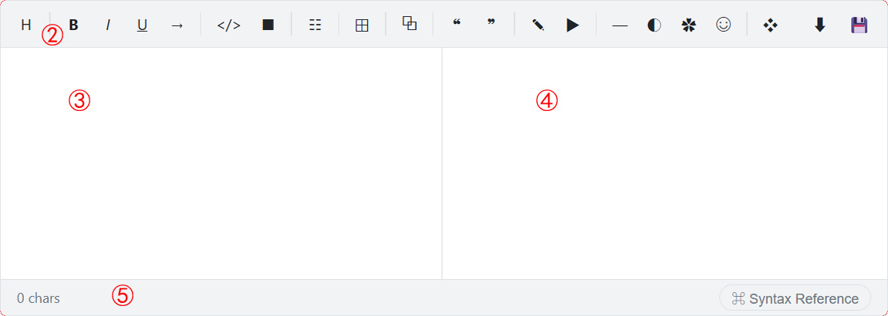
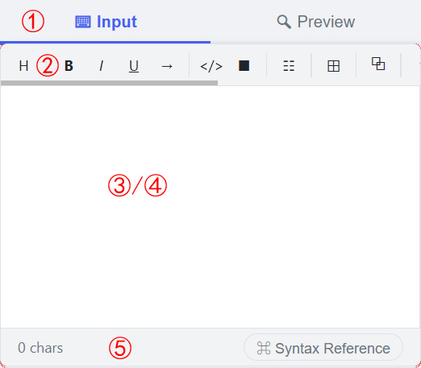

<p align="center">
  
</p>

<p align="center">
  
  
  
  
  
</p>

# DrewMark JS Editor

A **WYSIWYG editor** tailor-made for [DrewMark](../../../../drewneon/drewmark), built with **Vanilla JavaScript** — zero dependencies. With build-in [DrewMark JS Parser](../../../../drewneon/drewmark-js-parser), DrewMark JS Editor is capable of real-time editing, previewing, and downloading DrewMark content.

---

## Quick Start

```html
<!DOCTYPE html>
<html lang="en">
<head>
  <meta charset="UTF-8">
  <link rel="stylesheet" href="css/drewmark-editor.min.css">
</head>
<body>
  <div id="drewmark-editor"></div>
  <script src="js/drewmark-editor.min.js"></script>
  <script>
    drewmarkEditor();
  </script>
</body>
</html>
```

---

## Interface

Landscape mode: side-by-side editing and preview. 



Portrait mode: toggle between edit and preview.



---

## Features

- **Real-time preview** — see parsed HTML as you type
- **Syntax toolbar** — insert DrewMark syntax with one click
- **Smart keyboard behaviors** — Enter auto-continues lists, Tab navigates table cells
- **Download** — export as `.dm`, `.json`, or `.html`
- **Save callback** — hook into your backend (`onSave`), supports REST API, FormData, and localStorage
- **Single & Multi mode** — one editor or many on the same page
- **Multi-language** — auto-detect via `<html lang>`, ships with English and Simplified Chinese
- **Shared parser options** — `enable_emoji`, `enable_style`, `disable_syntax`, etc.

---

## Single Mode

```js
// Customize the container, load initial content, and enable save
drewmarkEditor({
  editor_id: 'my-editor',
  init_content: '# Welcome to DrewMark',
  onSave: ({ text, lines }) => {
    fetch('/api/save', {
      method: 'POST',
      headers: { 'Content-Type': 'application/json' },
      body: JSON.stringify({ content: text })
    });
  }
});
```

---

## Multi Mode

```html
<div class="editor"></div>
<div class="editor"></div>
```
```js
drewmarkEditor({
  editor_class: 'editor',
  multi_editor: [
    { init_content: 'Editor #1', textarea_name: 'section_a' },
    { init_content: 'Editor #2', textarea_name: 'section_b' }
  ]
});
```

---

## Parameters

| Parameter         | Type                 | Single Default      | Description                            |
| ----------------- | -------------------- | ------------------- | -------------------------------------- |
| `editor_id`       | `string`             | `'drewmark-editor'` | Container `id`                         |
| `editor_class`    | `string`             | `''`                | Container `class` (enables Multi Mode) |
| `init_content`    | `string \| string[]` | `''`                | Initial editor content                 |
| `textarea_name`   | `string`             | `'content'`         | `<textarea>` name attribute            |
| `textarea_height` | `number`             | `0` (auto-fill)     | Editor height in px                    |
| `enable_download` | `boolean`            | `false`             | Show download button                   |
| `onSave`          | `function`           | `null`              | Save callback (Single Mode only)       |
| `enable_emoji`    | `boolean`            | `false`             | Parse emoji syntax                     |
| `enable_style`    | `boolean`            | `false`             | Parse style blocks                     |
| `disable_syntax`  | `string[]`           | `[]`                | Disable specific syntaxes              |

---

## Multi-Language

The editor auto-detects the page language via `<html lang>`. To customize:

```html
<script type="module">
  await drewmarkEditorLang({ lang_path: './my-lang', fallback_lang: 'zh-cn' });
  drewmarkEditor();
</script>
```

---

## File Structure

```
project/
├── js/drewmark-editor.min.js     # Main program
├── css/drewmark-editor.min.css   # Stylesheet
├── lang/                         # Language files
├── docs/                         # Documentation
└── examples/                     # Sample pages
```

---

## Documentation

See [`docs/doc.md`](docs/doc.md) for the full API reference.

中文文档: [docs/doc-cn.md](docs/doc-cn.md)

---

## Related Projects

[DrewMark](../../../../drewneon/drewmark) (syntax specification)
[DrewMark JS Parser](../../../../drewneon/drewmark-js-parser)
[DrewMark JS Converter](../../../../drewneon/drewmark-js-converter) (convert between three formats)

---

## License

MIT
